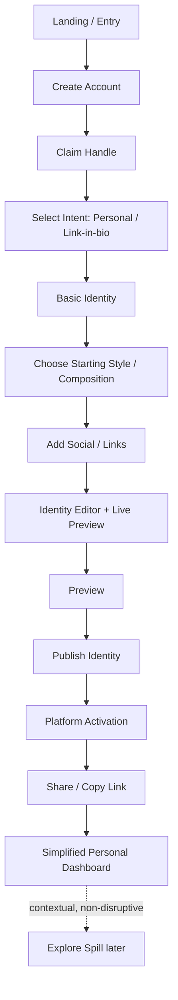

# J1 — Personal → First Identity Publish — LOCKED

**Goal:** publish a creative link-in-bio without exposing Product / Marketplace complexity.

## Locked rules
- Product, marketplace, Resource management, advanced analytics, SEO, automation, and bulk operations are not primary complexity in the first Personal journey.
- Spill is optional and discoverable later.
- Owner preview does not count as normal public audience traffic.
- Publish is explicit; draft work is not automatically public.
