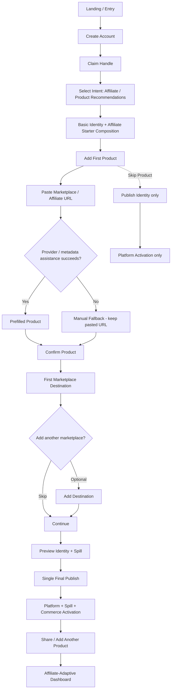

# J2 — Affiliator → First Commerce Activation — LOCKED

**Goal:** Identity foundation + first Product + at least one valid marketplace destination, with a single final publish moment.

## Locked rules
- Metadata extraction is assistance, never a dependency.
- Taxonomy complexity must not block first Commerce Activation.
- Persistent Spill Reference is system-managed.
- Multi-marketplace is optional beyond the first valid destination.
- Identity remains a full universal capability after activation.
