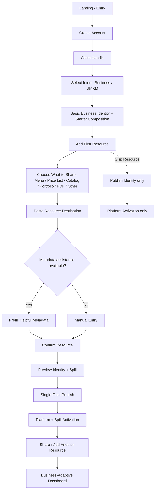

# J3 — Business / UMKM → First Resource Publish — LOCKED

**Goal:** brand Identity + first structured Resource live. Identity handles connection; Spill handles structured discovery.

## Locked rules
- Resource is structured and recognizable, not a raw URL.
- External Resource workflow is sufficient for MVP; hosted upload may come later.
- Thumbnail and category must not block the first Resource publish when unnecessary.
- Business can add Product later without account migration or type changes.
