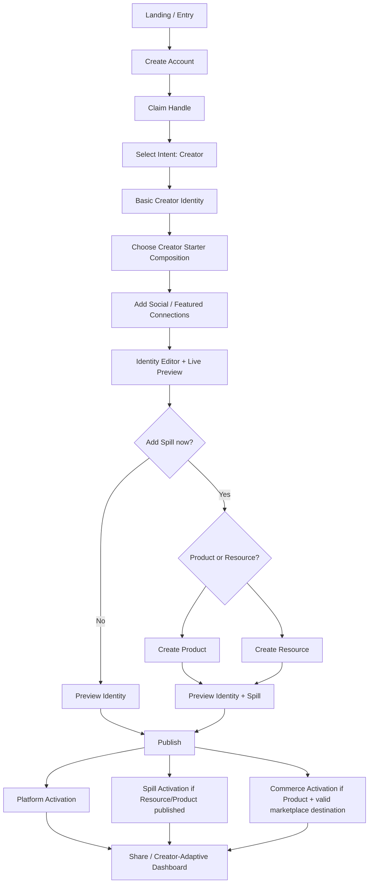

# J4 — Creator → First Creator Identity Publish + Optional Spill — LOCKED

**Goal:** creator publishes a polished personal-brand Identity; Spill is a natural optional extension, not a forced affiliate workflow.

## Locked rules
- Creator is not automatically an Affiliator.
- Social setup is progressive and structured, not a giant fixed platform form.
- Identity is navigation/connection; structured assets such as media kits, rate cards, catalogs, or grouped portfolio resources can live in Spill Resource.
- Curated starter layouts help the first experience; community-template browsing is not required.
- Identity remains first-class, with Spill/Analytics exposure becoming prominent only when relevant to actual usage.
