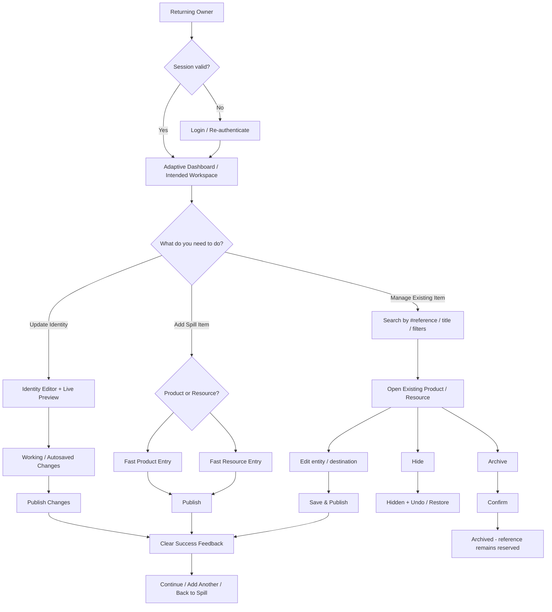

# J5 — Returning Owner → Add / Edit / Manage — LOCKED

**Goal:** recurring jobs are dramatically shorter than onboarding so Spall Spill becomes a real operating workflow.

## Locked rules
- Returning owners do not repeat onboarding and Home is not a mandatory waypoint.
- **Working / Autosaved State ≠ Public State.** Autosave protects work; Publish / Save & Publish changes public state explicitly.
- Editing a destination never recreates the Product/Resource or changes its persistent reference.
- Hide is reversible and favors immediate action + Undo; Archive is intentional retirement and requires confirmation.
- Hard delete is not a primary catalog action.
- Meaningful return analytics are based on productive actions, not login alone.
