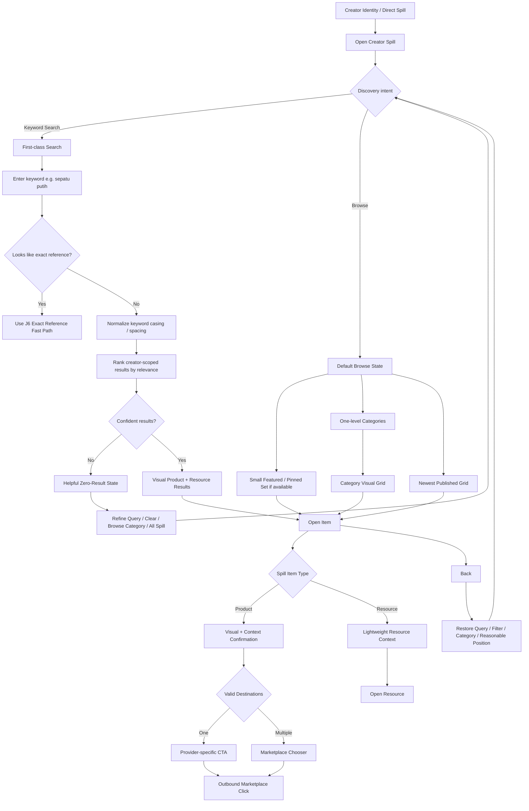

# J7 — Follower → Browse / Search Discovery — LOCKED

**Goal:** follower yang tidak tahu exact Spill Reference tetap dapat menemukan relevant Product/Resource melalui creator-scoped keyword search, category, browse, dan visual recognition tanpa login/signup friction.

## Locked rules

- MVP search/browse is scoped to the **current creator's Spill**, not platform-wide cross-creator discovery.
- Search and Browse are two first-class discovery paths.
- Public Spill remains useful before any query through search + categories + visual browse.
- Exact-reference input delegates to J6 and keeps absolute priority over generic keyword logic.
- Keyword search never auto-opens an item just because one result exists; auto-open is reserved for unique exact-reference match.
- Search ranking prioritizes relevance: strong title/token match, category/searchable metadata, context, then conservative typo/fuzzy assistance.
- **Reference lookup conservative; keyword discovery forgiving.**
- Fuzzy keyword help is allowed, but silent random/high-risk substitution is not.
- Popularity is not the primary MVP search-ranking signal.
- Product/Resource results stay visual, recognizable, and type-distinct.
- `All / Products / Resources` filters appear only when catalog composition makes them useful.
- Category hierarchy is one level for MVP.
- Search defaults to all published content in the current creator Spill; any active scoped filter must be visible and easy to clear.
- Empty query returns to normal browse state.
- Browse order: small **Featured/Pinned** set first, then **Newest Published**.
- Persistent reference is an identifier, not a sort key.
- Full-catalog manual drag ordering is not required; pinning/featured is the scalable curation tool.
- Marketplace filters and advanced sorting are not primary J7 MVP controls.
- Product/Resource detail behavior reuses J6.
- Back navigation preserves reasonable search/filter/category/position context.
- Zero results provide refine/browse recovery and do not promote unrelated creators in MVP.
- No follower login/account/email/app-download requirement.
- Discovery must remain usable for hundreds/thousands of items and cannot depend on endless scrolling.
- Instrument Search Success, Browse/Discovery Success, zero-results, query refinement, and time-to-item separately.

## Locked principles

**Creator-scoped discovery first.** Spall Spill solves discovery inside the creator relationship before attempting platform-wide shopping discovery.

**Featured/Pinned + Newest scales better than full-catalog manual ordering.**
