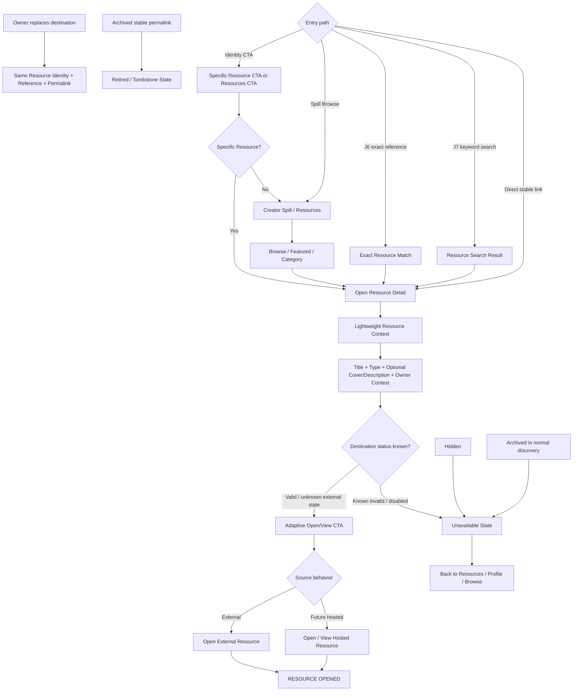

# J8 — Visitor → Resource Discovery — LOCKED

**Goal:** visitor can find the correct structured Resource, understand what it is, and open its valid source/destination with minimal friction and no follower login/signup requirement.

## Locked rules

- Resource is a structured Spall Spill entity; raw destination URL is not the Resource itself.
- Stable Resource permalink/reference follows the entity, not the underlying Drive/Notion/website/file URL.
- J8 supports Identity CTA, Spill browse, J6/J7 retrieval, and direct stable Resource link entry.
- Specific Identity CTA may target a specific Resource rather than always opening Spill root.
- Specific Resource CTA lands on lightweight Resource context/detail before external destination by default.
- Resource Detail is lighter than Product Detail: recognizable title, semantic type, optional cover/description, adaptive CTA, and owner context are enough.
- Thumbnail/cover and description are optional.
- Semantic type/action can be Menu, Price List, Catalog, Portfolio, Media Kit/Rate Card, Document/PDF, Website/External Resource, or Other.
- CTA wording adapts to the job: View Menu, Open Catalog, View Portfolio, View Price List, Open Document, Visit Website, etc.
- Hosted vs external source does not change the Resource mental model.
- Baseline action is Open/View, not forced Download.
- Safe validated outbound does not require heavy exit-confirmation ceremony.
- External accessibility is best-effort; Spall Spill does not guarantee third-party destination availability.
- Known invalid/disabled destination shows unavailable state instead of knowingly sending the visitor to a broken destination.
- Owner can replace a broken destination without recreating Resource or changing reference/permalink.
- Owner decides whether an updated artifact remains the same conceptual Resource or becomes a new entity.
- J8 reuses J6/J7 search/browse behavior and does not create a separate Resource search engine.
- Multiple Resources use browse/category/Featured mechanisms instead of flooding Identity with many CTAs.
- Embedded full document viewer is not an MVP requirement.
- Function determines Identity-vs-Resource semantics, not URL/file format.
- Hidden Resource is non-public; Archived Resource is excluded from normal discovery but old stable permalink may show retired/tombstone state.
- Public Resource flow requires no Spall Spill follower login/account/email/app download.
- Direct Resource pages keep owner/creator context and reasonable navigation back to Profile/Resources.
- Core MVP meaningful action is Resource Open; future hosted content may also use Resource Content Viewed.

## Locked principles

**Resource is an entity, not a URL.**

**Enough context, not ceremony.** Resource context should build confidence without adding Product-style friction.

**Function determines semantics, not file format.**
