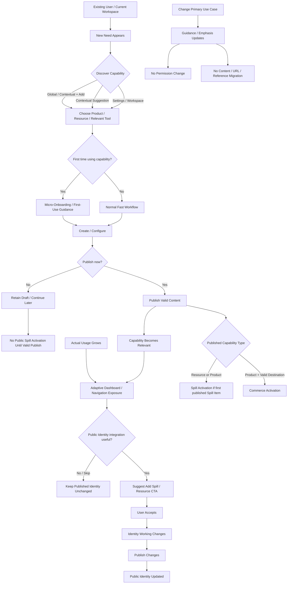

# J9 — Capability Expansion — LOCKED

**Goal:** existing user can start using a new Product/Resource/Spill/Analytics capability without account migration, permanent role conversion, or full re-onboarding.

## Locked rules

- Capability expansion is **additive, not transformational**.
- Primary Use Case, Used/Active Capabilities, and Navigation Exposure are separate concepts.
- Primary Use Case is a personalization signal, not permission/account type.
- Changing Primary Use Case never migrates or deletes existing Identity, Product, Resource, URLs, references, ownership, or analytics history.
- Actual usage may drive stronger workspace exposure than old onboarding intent, but the declared Primary Use Case is not silently rewritten.
- Capabilities remain discoverable through stable surfaces such as `+ Add` even when not persistent in primary navigation.
- First use may use **micro-onboarding**, never full account re-onboarding.
- **Capability onboarding, not account re-onboarding.**
- Publishing first Product/Resource can make Spill management more prominent in owner workspace.
- Navigation can adapt progressively, but must not unpredictably rearrange the whole dashboard.
- Capability activation never silently mutates the published Identity.
- Public integration suggestions create Identity working changes and still require explicit Publish Changes.
- Draft/unpublished capability use does not expose public Spill or count as Spill/Commerce Activation.
- Universal Product/Resource capability does not require enable/disable account-mode switches.
- Users who stop using a capability can hide/archive content or reduce workspace exposure without account downgrade/migration.
- Suggestions are contextual, dismissible, frequency-controlled, and non-spammy.
- Creator-facing Analytics can become prominent when meaningful without changing the underlying instrumentation or account mode.
- Expansion paths are instrumented for product learning without treating intent as permanent user class.
- Platform Activation, Spill Activation, and Commerce Activation remain the canonical activation stages.

## Locked principles

**Universal capabilities, personalized exposure.**

**Capability onboarding, not account re-onboarding.**

**Expansion is additive.**

**Public changes stay explicit.**
